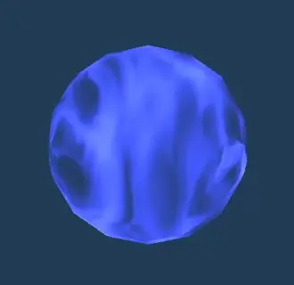

## Link

<https://github.com/PepperXu/VFX-Shader>

## Properties

### Render Mode

- Blend Mode: How the effect blends with the background. Select among Additive/Blend_Add/Alpha_Blended. 效果如何与背景融合。目前有加乘混合/透明度加乘混合/透明度混合三种。
- Cull Mode: Controls which sides of polygons should be culled (not drawn). Select among Off/Front/Back. 效果如何隐藏面。

### Primary

- Tint Color: Base color of the particle. 效果的基本颜色。
- Base (RGB) Trans (A): Base Texture of the particle. 效果的基本贴图。
- Tiling: Control the scale of the texture. 贴图平铺的缩放大小。
- Offset: Control the position of the texture. 贴图平铺的偏移量。
- Main Rotation: Rotate the texture counter-clockwise. 逆时针旋转贴图。
- Main UV X Scroll: Scroll the texture over time along the x axis. 沿X轴随时间移动贴图。
- Main UV Y Scroll: Scroll the texture over time along the y axis. 沿Y轴随时间移动贴图。

- Use Main Posterize: Enable posterize options. 展开海报化选项。
    - Posterize: Steps of posterization. A higher value means more steps/less posterization. 海报化的阶层数。越高的数值代表越多阶层/更弱的海报化效果

- Use Mirror: Enable mirror options. 展开镜面化选项。
    - UV Mirror X: Flip texture along the x-axis. 将贴图沿X轴翻转。
    - UV Mirror Y: Flip texture along the y-axis. 将贴图沿Y轴翻转。

### Mask

- Use Mask: Enable alpha mask. 展开蒙版选项。
- Mask Texture: Mask texture. Red channel is used for masking. 蒙版贴图。红色通道被用作蒙版。
    - Tiling: Control the scale of the mask. 蒙版贴图平铺的缩放大小。
    - Offset: Control the position of the mask. 蒙版贴图平铺的偏移量。
- Mask Rotation: Rotate the mask counter-clockwise. 将蒙版逆时针旋转。
- Mask UV X Scroll: Scroll the mask over time along the x-axis. 蒙版沿X轴方向随时间移动。
- Mask UV Y Scroll: Scroll the mask over time along the y-axis. 蒙版沿Y轴方向随时间移动。
- Mask Strength: The strength of the mask. Can go over 1 for more transparency. 蒙版的强度。大于一会有更强的遮蔽效果。
- Use Mask Posterize: Enable mask posterize options. 展开蒙版贴图海报化选项。
    - Posterize: Steps of posterization. A higher value means more steps/less posterization. 蒙版贴图海报化的阶层数。越高的数值代表越多阶层/更弱的海报化效果。

### Distortion

- Use Distortion: Enable UV distortion options. 展开变形选项。
- Distortion Texture: Distortion noise texture, red and green channel for displacement, alpha channel for dissolve. 变形噪点贴图。
    - Tiling: Control the scale of the distortion noise. 噪点的缩放大小。
    - Offset: Control the position of the distortion noise. 噪点的偏移量。
- Displacement: The positive or negative intensity of UV distortion. 粒子UV受噪点贴图影响的位移的大小。
    - U Speed: The speed of distortion noise moving along the x-axis. 噪点随时间沿X/U轴的移动速度。
    - V Speed: The speed of distortion noise moving along the y-axis. 噪点随时间沿Y/V轴的移动速度。
    - Apply Displacement to Mask: If alpha mask is enabled, whether or not apply distortion to mask. 当使用蒙版时，是否将UV位移使用在蒙版上。

- Use Dissolve: Enable dissolve animation. 展开溶解动画的选项。
    - Dissolve Amount: Control the degree of dissolving. 0 for original texture. 1 for complete dissolve. 溶解的成度。0是原本的材质，1是完全溶解。
    - U Speed: The speed of the dissolve noise moving along x-axis. 溶解动画沿X轴的移动速度。
    - V Speed: The speed of the dissolve noise moving along y-axis. 溶解动画沿Y轴的移动速度。
    - Use Edge: Enable the rim or burnt effect around the dissolving edges. 开启溶解时的边缘效果。
        - Thickness: The thickness of the rim or burnt effect. 边缘的大小。
        - Gradient Start: The outer color of the burnt effect, or the color closer to the dissolving edges. 边缘的外部颜色。
        - Gradient End: The inner color of the burnt effect. 边缘的内部颜色。
    - Along UV: Enable dissolve animation along UV axis. 沿UV方向进行溶解。
        - Axis: Use u or v axis. 沿U轴或V轴。
        - Reverse: The direction of the animation. 反向溶解。
        - Noise Strength: The intensity of displacement near the border. 边缘的位移大小。

### Others

- Use Sheet Animation: Enable flipbook animation. 展开帧动画选项。
    - Tiles X: The number of tiles along the x-axis. 动画帧的行数。
    - Tiles Y: The number of tiles along the y-axis. 动画帧的列数。
    - FPS: Speed of the flipbook animation. 动画帧速。
- Use Bloom: Enable bloom. 开启发光。
    - Brightness: The intensity of the bloom. 发光强度。

